# Warehouse Order and Stock Manager
*Created by:  <a href="https://github.com/DimitrisToumazatos" title="Dimitris Toumazatos">Dimitris Toumazatos</a>, <a href="https://github.com/alexisthedev" title="Alexios Papadopoulos">Alexios Papadopoulos-Siountris</a> and <a href="https://github.com/DFotogiannopoulos" title="Dimitris Fotogiannopoulos">Dimitris Fotogiannopoulos</a>*

The teams worked together on the App's design. Later on, each member focused mainly on the following aspects:
Dimitris Toumazatos: Automated Testing using JUnit.  
Alexios Papadopoulos-Siountris: App Functionality.  
Dimitris Fotogiannopoulos: Detailed Analysis and Graphs demonstrating App's usage.  

This document gives an overview of the application and its functionality.

## Overview

The application allows medicine warehouse managers to manage their stock and service orders.

**Actors**
* Warehouse Manager *(primary)*
  * Receives and services online orders from clients and pending backorders. Updates the warehouse stock.
* Drug Store Owner
  * Orders medical supplies from the warehouse.

## Functionality

**Manager**
* View client information and orders
* Service client orders
* Update product stock
* Cancel an order in case on insufficient stock
* Alert clients in case of product batch withdrawal
* View historical statistics

**Clients**
* Registration
* Search and view products
* Online order of products
* Order out of stock products, to be serviced upon future availability (backorders)
* Store draft orders for future submission
* Complete draft orders

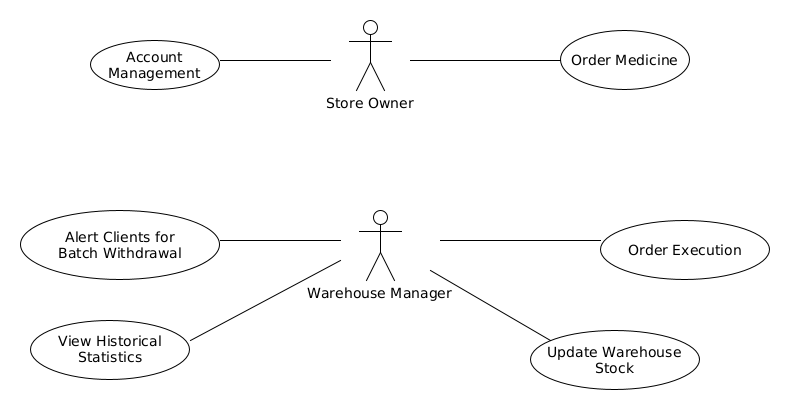

## Use Case 1: Medicine Order

### Basic Flow

1. The system asks the user if they want to create a new order or continue a saved draft order.

2. The user searches for a product they want to buy by using search criteria such as: product name, medicinal category, and EOF number.

3. The system displays the product listing and gives the user the option to select the quantity and add the product to their order.

4. The user selects the desired quantity.

5. The system adds the product to their order.

6. The system gives the user the option to continue adding products to their order, complete it, or save it as a draft order.

7. The system checks if all the product quantities are available.

8. The order is sent to the warehouse manager.

#### Alternative Flows

1a. The user chooses to create a new order and a new empty order is created.

1b. The user chooses to continue a saved draft order.

* 1ba. If there are saved draft orders, the system displays the user with all of them, giving the user the option to select which one to continue.

* * i. The user selects the saved draft order they want to continue.

* 1bb. If there are no saved draft orders, then a new empty order is created.

2a. If the ID number does not match any product in the system, then the user is notified and prompted to search again.

6a. If the user selects to add another product to the order, then the use case returns to Step 2 of the basic flow.

6b. If the user selects to save the order as a draft, then the system saves the order in the user's account. The Use Case ends.

7a. If some product quantities are not available, the system gives the user the option to create a backorder.

* 7aa. If the user opts to not create a backorder, only the maximum available quantities are ordered.

* 7ab. If the user opts to create a backorder, the maximum available quantities are ordered normally, while the excess product is assigned to a backorder.

* 7ac. If the user opts to completely abandon the order, the Use Case ends here.

## Use Case 2: Warehouse Stock Update

### Basic Flow

1. The warehouse manager enters the product type ID.

2. The system dislpays a popup showing the product name and a field for the user to type the quantity

3. The system increases the product quantity by the given amount.

4. The system automatically checks if any standing backorders can be serviced.

5. The system services eligible backorders on a reverse chronoligical order.

6. The system reduces the quantity of the sold product accordingly and marks the backorder as complete.

7. The system notifies the client who placed the backorder that their order has been completed by email. The Use Case returns to Step 4 of the basic flow.

#### Alternative Flows

1a. If the product type ID is invalid, then the system notifies the user and the Use Case returns to Step 1 of the basic flow.

2a. In case of a mistype the user is given the option to close the popup and the Use Case returns to Step 1 of the basic flow.

4a. If the are not any servicable backorders, the Use Case ends here.

## Use Case 3: Order Execution

### Basic Flow

1. The system displays the standing orders for execution in reversed chronological order.

2. The warehouse manager chooses which order to accept and which to cancel.

3. The system checks if the order contains any backorders and creates them.

4. The warehouse stock is reduced by the ordered amount and the order is marked as 'Complete'. The Use Case returns to Step 1 of the basic flow.

#### Alternative Flows

1a. If the warehouse manager is done servicing orders or there are no other orders then the Use Case ends here.

2a. If an order is rejected the client is informed via email and the order is removed. The Use Case returns to Step 1 of the basic flow.

## Use Case 4: Alert for Bad Batch

### Basic Flow

1. The warehouse manager enters the batch ID of the faulty product.

2. The system sends a message to all the store owners that have purhcased a product belonging to the recalled batch.

3. The system automatically tags any products in the warehouse that belong to the recalled batch and removes them from stock, informing the warehouse manager.

#### Alternative Flows

1a. If the batch ID is invalid, the system notifies the warehouse manager. The Use Case returns to Step 1 of the basic flow.

## Use Case 5: View Historical Statistics

### Basic Flow

1. The warehouse manager enters a product or user ID they want to get statistics for, along with a time period for the enquiry.

2. The system displays all relative statistics matching the given input. The Use Case returns to Step 1 of the basic flow.

#### Alternative Flows

1a. If the given ID is invalid the system notifies the user. The Use Case returns to Step 1 of the basic flow.

1b. If the warehouse manager is done searching the Use Case ends here.

2a. If there are no recorded purchases matching the ID and time period given, then the system notifies the user. The Use Case returns to Step 1 of the basic flow.

## Use Case 6: Account Management

### Login/Register

### Basic Flow

1. The system displays an option to login or register.

2. The user selects to register.

3. The system requests the user to enter account details (eg. email, password, AFM, name, AMKA).

4. The system creates a new account with the given details.

5. The system logs in the user.

#### Alternative Flows

2a. If the user selects to login

* i. The system asks for the email and password.

* ii. The user enters the email and password.

* * 2aiia. If the details are incorrect then the Use Case returns to Step 2ai of the alternative flow.

* iii. The Use Case continues from Step 5 of the basic flow.

## Activity Diagrams

**A) Order from Client**  

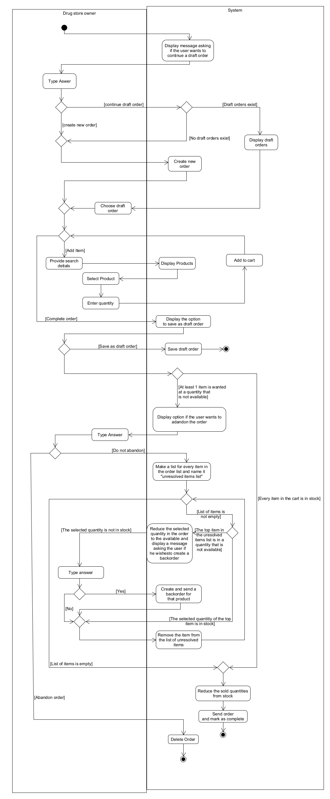

**B) Update Warehouse Stock**  

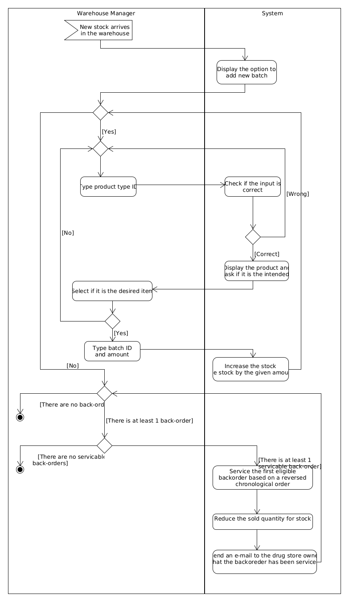

## Domain Model Diagram

**A) Domain Model with the basic classes**  

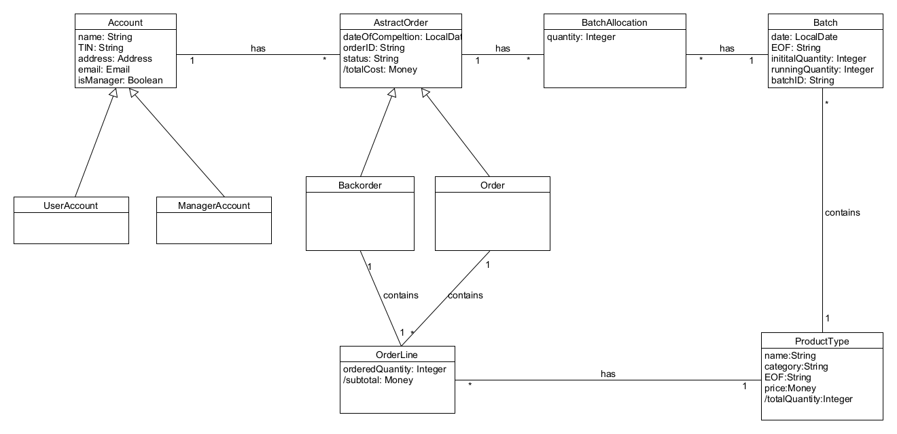

## Sequence Diagram

**A) Order from Client**  

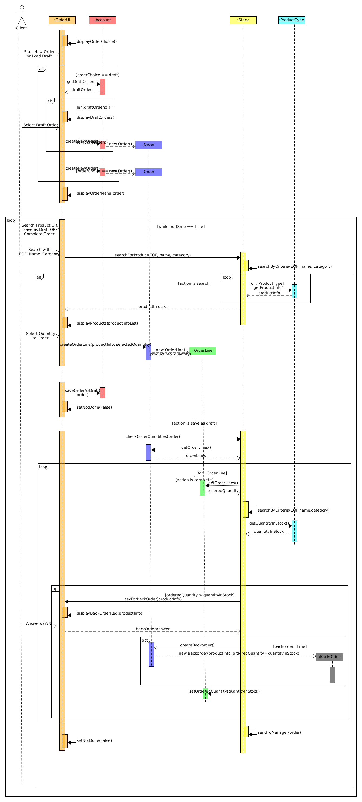

**B) Update Warehouse Stock**

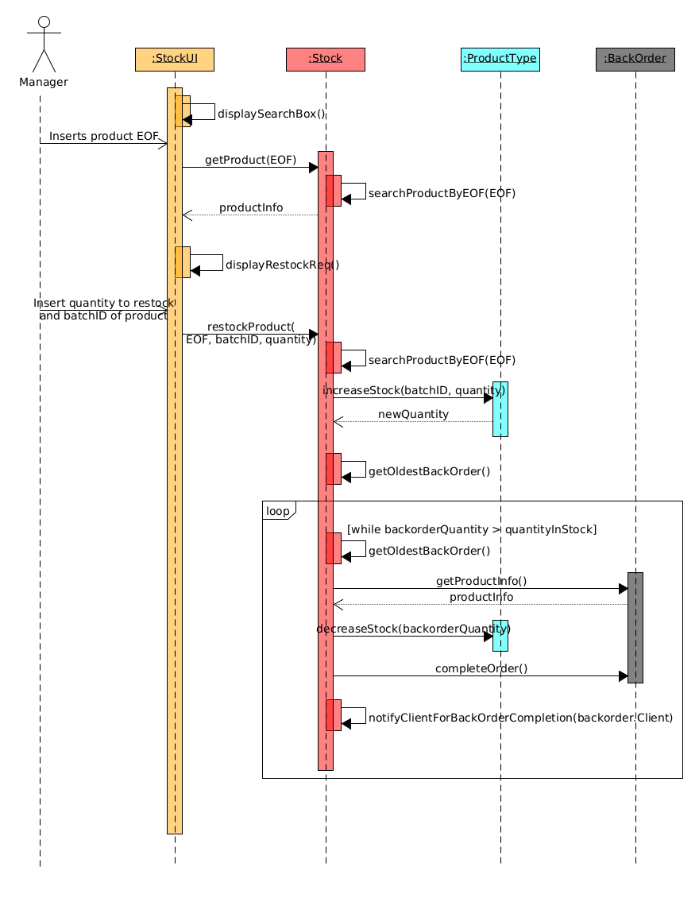

## Non-functional requirements

*1. Storage requirements*
The app needs adequate storage to be installed and store extra data. In addition, the software should not take up unnecessary space and cause problems on the device.

*2. Data protection*
Sensitive information about the warehouse (login information, financial records, etc.), its services (products, sales ,etc.) and its customers (names, phones, etc.) need to be stored safely. Only authorized personnel should have access to this information.

*3. Software reliability*
The software needs to be able to handle errors and crashes without affecting the users and the data displayed.

*4. Software availability*
The app should be distributed on all types of devices (smartphones, tablets, etc.) and all operating systems.

*5. Latency and throughput*
The app needs to return results and respond to users' requests(eg. confirm order submission by a pharmacist) in a reasonable timeframe.

The app must be able to handle the necessary data and have a sufficient throughput, when it comes to the amount of data associated with a user action (eg. order high amount of different products).

## Static view Domain Model

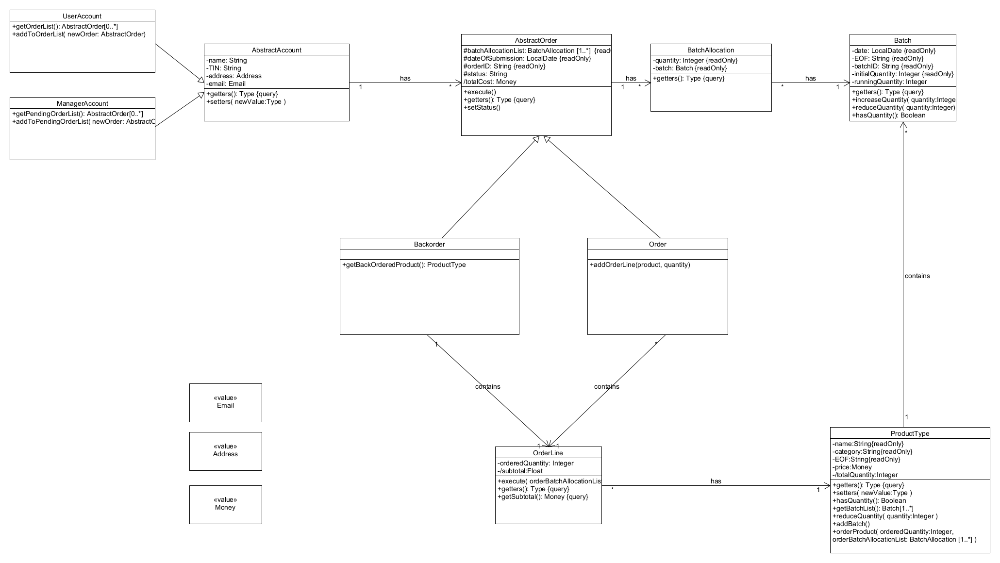

## Test Coverage

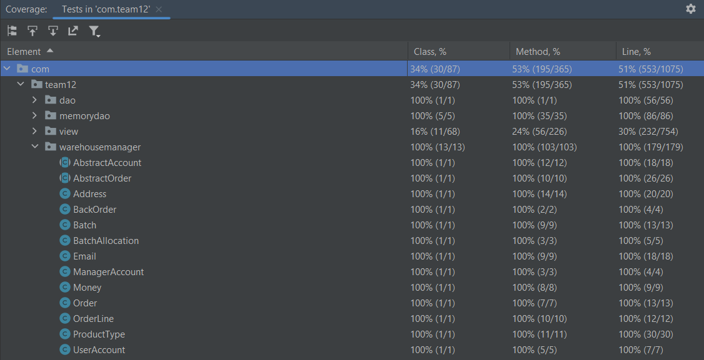

## Customer Domain Model

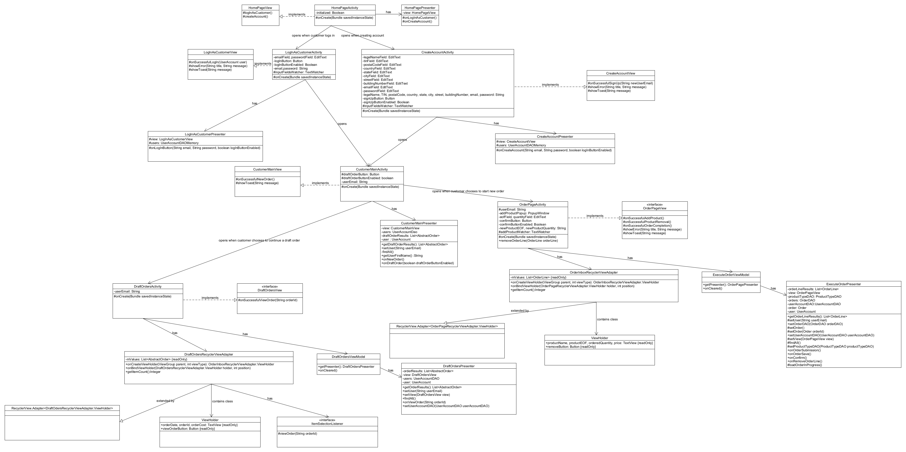

## Manager Domain Model

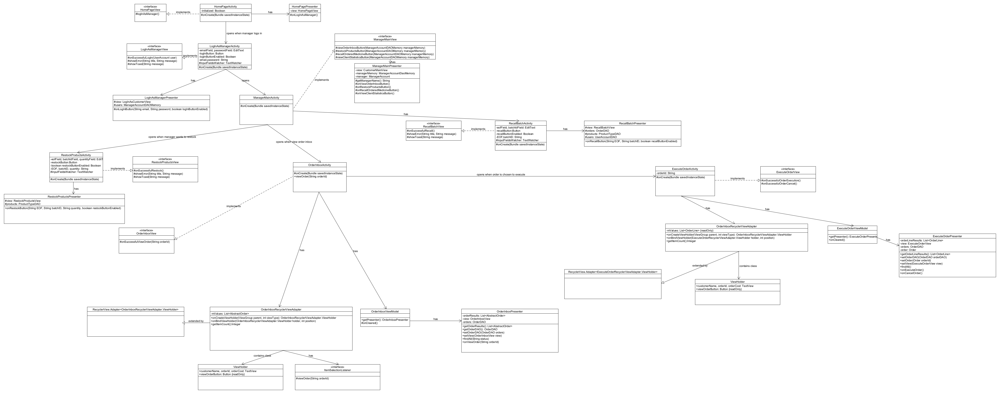

## Log in button as customer

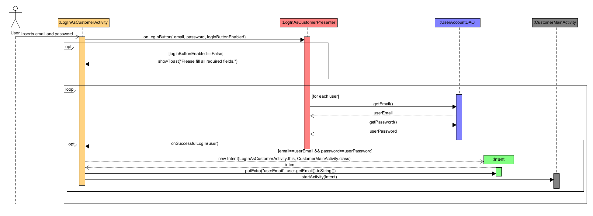

## Log in button as manager

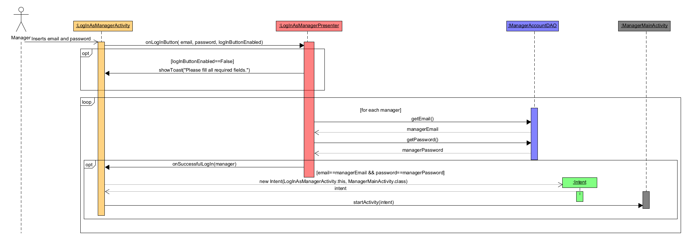

## Sign Up
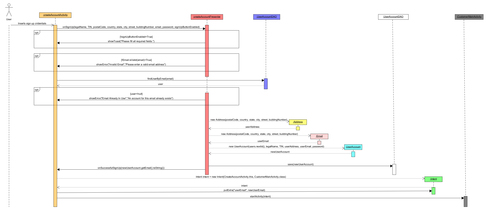

# Successful add product to order

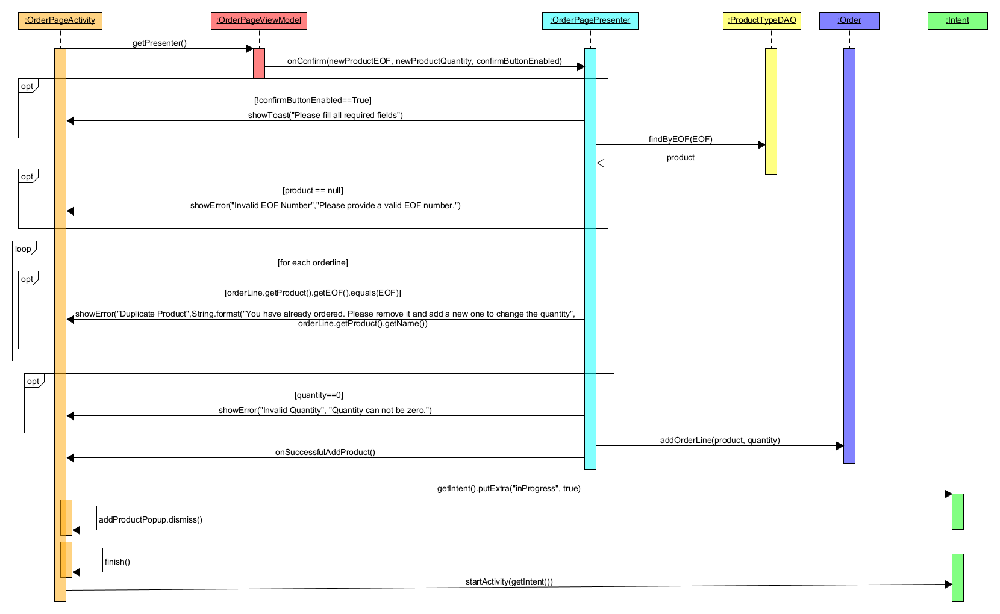

## Restock Button
 
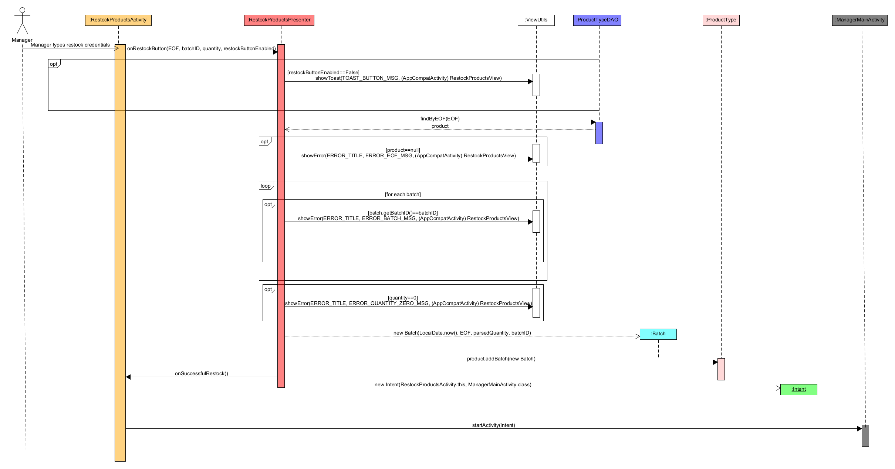

## Successful Order Execution

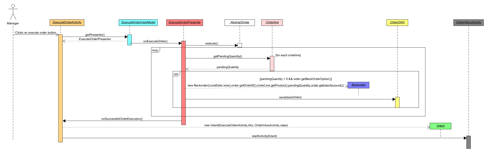

## Execute Order

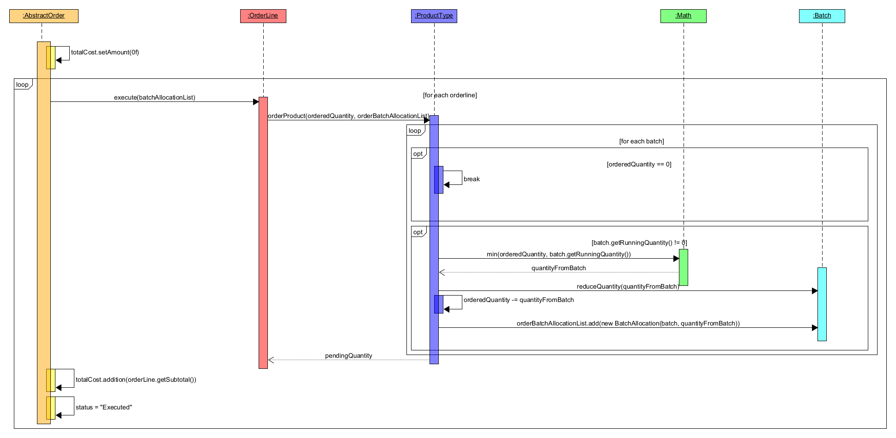

## Recall Batch

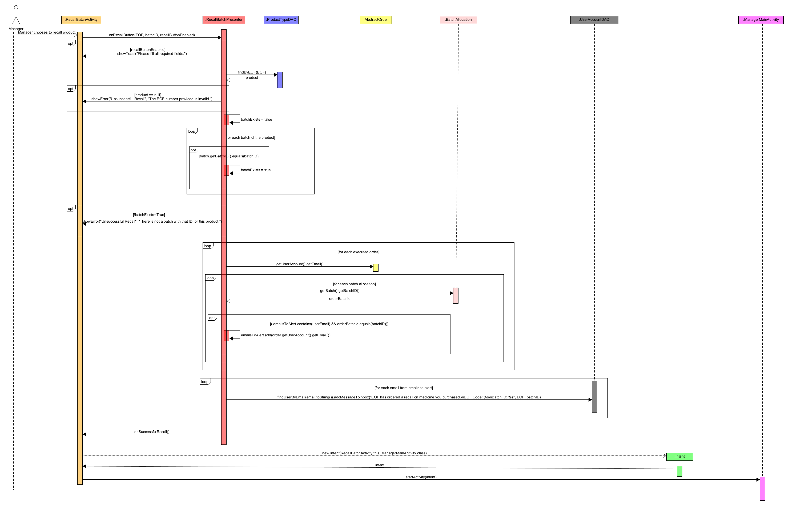
